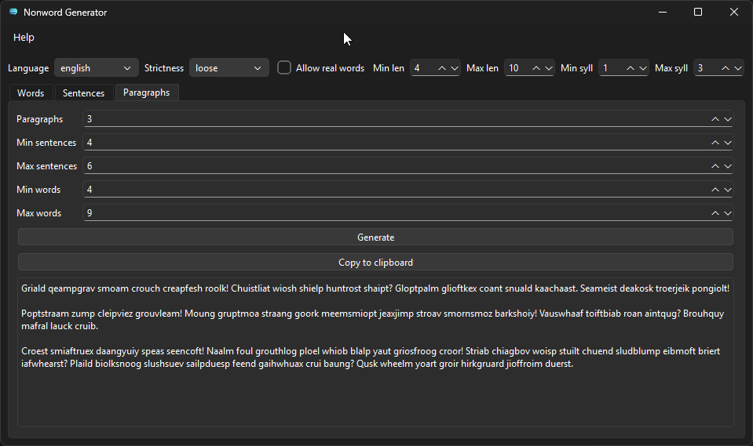

# nonwordgen

> nonword-gen — because real words are overrated!


---

`nonwordgen` is a multilingual text generator that creates **fake words, sentences, and paragraphs** that *look like* they belong to real languages — but aren’t.  
It’s ideal for **lorem ipsum–style filler text**, **UI design**, **test data**, **creative writing**, or anywhere you need realistic-looking nonsense.

Under the hood, it uses a **phonotactic syllable model**, **language plugins**, and **dictionary-based filters** to ensure generated text looks plausible while avoiding real vocabulary.  
But using it is easy: pick a language, choose strictness, and generate.

---

## ✨ Features

- ✔️ Generate **nonwords**, **sentences**, and full **paragraphs**  
- ✔️ Currently Supports **29 languages**, including accents & proper orthography  
- ✔️ **Plugin-based** language architecture  
- ✔️ Optional dictionary filtering to avoid real words  
- ✔️ **GUI**, **CLI**, and **Python API**  
- ✔️ Cross-platform: Windows / macOS / Linux  

---

## 📥 Installation

Since `nonwordgen` is not yet published to PyPI, download it directly from **GitHub Releases**:

➡ **Download the latest wheel or source package:**  
[nonwordgen Releases](https://github.com/taggedzi/nonwordgen/releases)

Install using pip (point to your downloaded file):

```bash
# Install from wheel
python -m pip install nonwordgen-<version>-py3-none-any.whl

# Or install from source
python -m pip install nonwordgen-<version>.tar.gz
````

For development:

```bash
git clone https://github.com/taggedzi/nonwordgen.git
cd nonwordgen
python -m pip install -e ".[dev]"
```

Extras are available if you want GUI or dictionary support during development as well:

```bash
# GUI support
python -m pip install ".[gui]"

# Dictionary / wordfreq support
python -m pip install ".[dictionaries]"
```

---

## 🧩 Library Usage

```python
from nonwordgen import WordGenerator, Strictness

gen = WordGenerator(
    min_length=5,
    max_length=9,
    strictness=Strictness.MEDIUM,
    language="english",  # default plugin
)

print(gen.generate_one())
print(gen.generate_many(10))
```

---

## 🖥️ CLI Usage

Words (English):

```bash
nonwordgen -n 20 --min-length 4 --max-length 8 --strictness strict
```

Words (Spanish):

```bash
nonwordgen -n 20 --language spanish --min-length 4 --max-length 8
```

Sentences:

```bash
nonwordgen sentences -n 5 --language french --min-words 3 --max-words 8
```

Paragraphs:

```bash
nonwordgen paragraphs -p 2 --language german --min-sentences 2 --max-sentences 4
```

Launch GUI:

```bash
nonwordgen gui
```

You can also launch the GUI directly via the separate entry point:

```bash
nonwordgen-gui
```

Select your language, chose your options and click generate!



---

## 🌍 Supported Languages

`nonwordgen` includes plugins for:

**english**, **spanish**, **french**, **portuguese**, **indonesian**,
**swahili**, **german**, **turkish**, **russian**, **vietnamese**,
**hindi**, **korean**, **italian**, **dutch**, **tagalog**, **romanian**,
**swedish**, **norwegian**, **danish**, **afrikaans**, **yoruba**,
**polish**, **czech**, **hungarian**, **greek**, **thai**, **hebrew**,
**scb**, **malay**

To inspect programmatically:

```python
import nonwordgen
print(nonwordgen.available_languages())
```

---

## 📦 Optional Dependencies

These are **optional** and must be installed separately if desired:

- `wordfreq` — frequency-based dictionary filtering
- `PyQt6` — enables the GUI

Install one or more manually:

```bash
pip install wordfreq
pip install PyQt6

# Or via extras when installing from source / editable:
python -m pip install ".[dictionaries]"
python -m pip install ".[gui]"
```

---

## 🛠 Development

Install dev dependencies and nox:

```bash
python -m pip install -e ".[dev]"
python -m pip install nox
```

Common tasks via nox:

```bash
nox                  # run default sessions (tests + lint)
nox -s tests         # run test suite
nox -s coverage      # run tests with coverage + coverage.xml
nox -s lint          # run Ruff lint checks
nox -s lint_fix      # auto-fix with Ruff + Black
nox -s format        # format code with Black
nox -s typecheck     # run mypy
nox -s build         # build GUI release via build_release.py
nox -s build_package # build wheel + sdist into dist/
nox -s build_dist    # Linux-only sdist + wheel build (CI-friendly)
nox -s build_exe     # build standalone Windows EXE (no-op on non-Windows)
```

You can still run `pytest` or `python -m build` directly if you prefer, but the GitHub Actions CI uses the nox sessions above so you can reproduce CI locally with the same commands.

Artifacts from builds appear under `dist/` (wheels/sdists from `build_package`, and the Windows executable from `build` / `build_exe`).

---

## 📤 Release Process (GitHub Only)

1. Update version in `pyproject.toml` (`[project].version`)
2. Run tests & build artifacts
3. Commit → tag → push
4. Draft a GitHub Release

   - Upload `.whl` and `.tar.gz` files
   - Add changelog notes

No PyPI steps required unless you publish there later.

---

## 📄 License

MIT License — see `LICENSE`.

---

## 🤖 AI Disclosure

Some documentation and text were drafted with assistance from OpenAI models and reviewed manually.

---

## 📚 Third-Party Notices

- **PyQt6** — GUI backend
- **wordfreq** — Apache-2.0 licensed

All optional extras are installed separately and not bundled by default.
